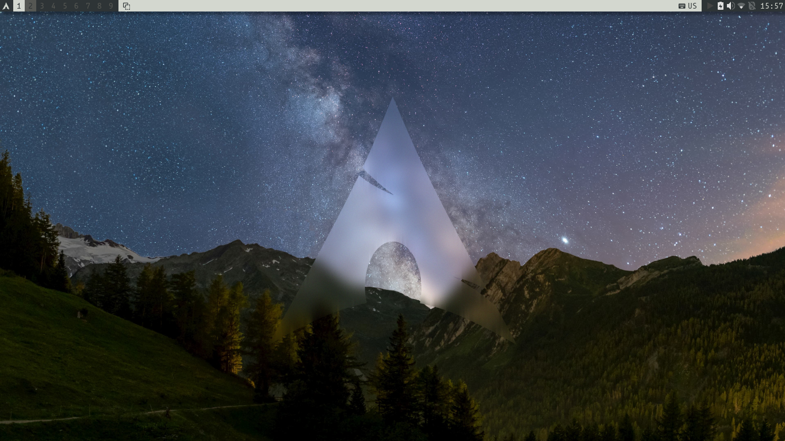
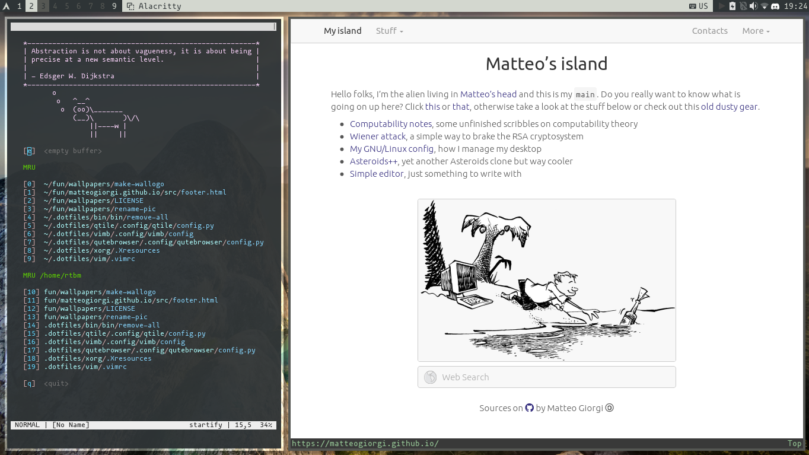
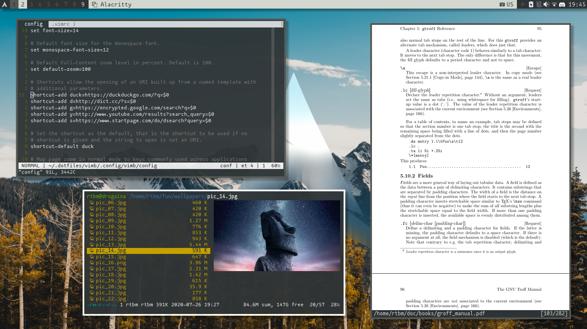

# Dotfiles

These repo contains my major dotfiles. I keep them organized using [GNU Stow](https://www.gnu.org/software/stow/) and it's sweet!. Below there are some samples and [here](assets/.keys.txt) the list of my Qtile keybindings. [Click clack](https://matteogiorgi.github.io/config.html) for more info.

  

  

  

  

