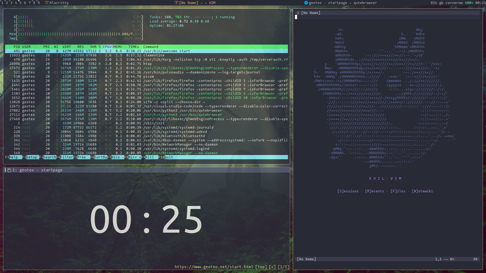
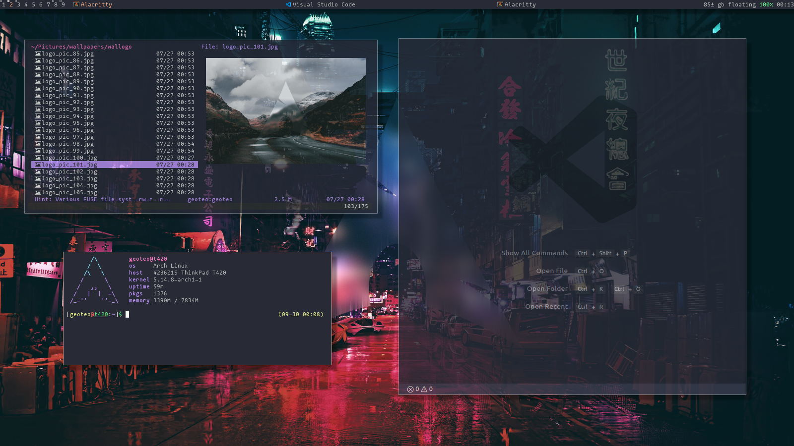

# Dotfiles

These repo contains my major dotfiles. I keep them organized using [GNU Stow](https://www.gnu.org/software/stow/) and it's sweet. Below there is a sample, [click clack](https://matteogiorgi.github.io/config.html) for more info.

<p align="center"></p>

<p align="center"></p>


## I'm using BSPWM nowadays!

Remember to write `/etc/X11/xorg.conf.d/10-synaptics.conf` with the following settings:

```
Section "InputClass"
    Identifier "touchpad"
    Driver "synaptics"
    MatchIsTouchpad "on"
        Option "TapButton1" "1"
        Option "TapButton2" "3"
        Option "TapButton3" "2"
        Option "VertEdgeScroll" "off"
        Option "VertTwoFingerScroll" "on"
        Option "HorizEdgeScroll" "off"
        Option "HorizTwoFingerScroll" "on"
        Option "CircularScrolling" "on"
        Option "CircScrollTrigger" "2"
        Option "EmulateTwoFingerMinZ" "40"
        Option "EmulateTwoFingerMinW" "8"
        Option "CoastingSpeed" "1"
EndSection
```


### Necessary tools

- sxhkd (keybinder)
- polybar (desktop bar)
- picom (compositor effects)
- feh (img viewer and wallpaper setter)
- networkmanager (for network-manager-applet)
- blueman (for blueman-applet)
- xorg-xrdb (load Xresources)
- xorg-xmodmap (run Xmodmap)
- xsettingsd (xsettings deamon)
- xdotool (command-line X11 automation tool)
- xorg-xrandr (cli interface to RandR extension)
- xdo (utility for performing action on windows)
- imagemagick (image manipulation program)
- pamixer (pulseaudio command-line mixer)
- ueberzug (utility to draw images un terminal)
- nodejs (js runtime environment)
- texlive-most (document preparation)
- pandoc (document converter)
- ripgrep (recursive search tool)


### lang package managers

- npm
- python-pip
- cargo (rust)


### Core utility programs (already preconfigured)

- zsh/bash (shells)
- alacritty/xterm (terminal emulators)
- vim/amp (text editors)
- vifm/broot (file managers)
- fzf (fuzzy finder)
- tmux (terminal multiplexer)
- vimpager (vim as PAGER)
- bat (glorified cat)
- tig (git client)
- touchcursor (fancy keymaps)
- zathura (document viewer)
- sxiv (image viewer)


### Other useful programs (no config needed)

- arandr (gui xrandr interface)
- pavucontrol (gui pulsaudio volume control)
- lxappearence/qt5ct (gui gtk/qt5 theme switcher)
- pcmanfm/xarchiver (gui file/archive manager)
- brave (gui web browser)
- vlc (gui video/music player)
- xed (gui text editor)
- mplayer/id3v2 (media player/labeller)
- sc-im (spreadsheet editor)
- calcurse (agenda)
- htop (glorified top)
- dmenu (suckless menu)
- st (suckless terminal emulator)
- slock (suckless lockscreen)
